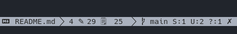

# Git Status - Plugin for [micro editor](https://micro-editor.github.io)
Information about git in status bar.



## Installation

### Settings
Add this repo as a **pluginrepos** option in the **~/.config/micro/settings.json** file (it is necessary to restart the micro after this change):
```json
  "pluginrepos": [
    "https://gitlab.com/taconi/micro-git-status/-/raw/main/repo.json"
]
```

### Install
In your micro editor press **Ctrl-e** and run command:
```
> plugin install gitStatus
```
or run in your shell
```sh
micro -plugin install gitStatus
```
